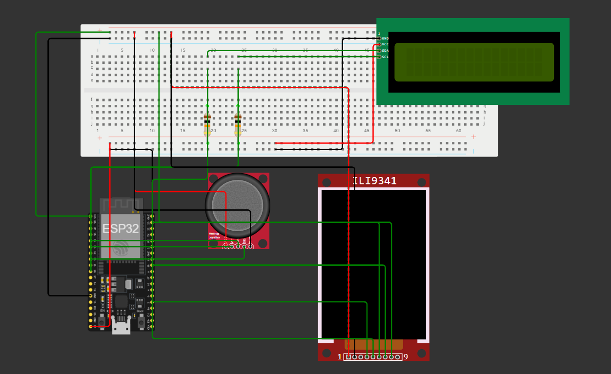

# ESP32 Desk Buddy

## Project Goal
The primary goal of this project was to get a basic understanding of electronics, component wiring, and C++ syntax. 

**Future Goal:** To solder all these components together onto a custom PCB or protoboard, add a battery, and make the entire project portable!

## Features
This smart dashboard features a menu system driven by a physical joystick, allowing you to toggle between 4 distinct modes:
1. **Spotify Now Playing:** Displays the current track and artist on the LCD, while downloading and rendering the live Album Art directly on the TFT screen.
2. **System Storage:** Displays real-time ESP32 RAM usage (Free RAM on LCD, percentage, and visual progress bar on the TFT).
3. **Trading212 Tracker:** Fetches live Trading212 portfolio data, showing unrealised profit/loss on the LCD and progress towards a goal on the TFT screen.
4. **Image Showcase:** Renders a hardcoded image of a Nissan GTR R35 from flash memory - the coolest car on earth.
---

## Hardware Requirements
*   ESP32 Development Board
*   TFT Screen (SPI Interface, ST7789 Driver, 240x240)
*   16x2 LCD Screen (with I2C Backpack)
*   Analog Joystick Module
*   Breadboard & Jumper Wires

---

## Wiring Guide
You can wire this project completely using the pin mappings below, or refer to the visual guide:

### Joystick Module
| Joystick Pin | ESP32 Pin | Notes |
| :--- | :--- | :--- |
| VRx (X-Axis) | **GPIO 34** | Analog Input |
| VRy (Y-Axis) | **GPIO 35** | Analog Input |
| SW (Button) | **GPIO 33** | Digital Input (Internal Pullup used) |
| VCC | **3.3V** | Power |
| GND | **GND** | Ground |

### 16x2 I2C LCD
| LCD Pin | ESP32 Pin | Notes |
| :--- | :--- | :--- |
| SDA | **GPIO 21** | I2C Data |
| SCL | **GPIO 26** | I2C Clock (Note: standard ESP32 is usually 22, but we configured 26) |
| VCC | **5V / VIN**| Usually requires 5V to power the backlight properly |
| GND | **GND** | Ground |

### TFT SPI Screen (ST7789)
| Standard TFT Pin | Standard ESP32 SPI Pin | Notes |
| :--- | :--- | :--- |
| VCC | **3.3V** | Power |
| GND | **GND** | Ground |
| MOSI / SDA | **GPIO 23** | SPI Data |
| SCLK / SCK | **GPIO 18** | SPI Clock |
| CS | **N/A** | Disables the CS pin requirement (-1) |
| DC / RS | **GPIO 22** | Data / Command |
| RST | **GPIO 4** | Reset |
| BL / BLK | **N/A** | Backlight is hardwired (-1) |

---

## Installation & Setup

### 1. Library Dependencies
Install the following libraries via the Arduino Library Manager:
*   `LiquidCrystal_I2C`
*   `TFT_eSPI`
*   `TJpg_Decoder`
*   `ArduinoJson`
*   `SpotifyEsp32`

### 2. Copy the Required Files
You will notice a `copies/` folder in this repository. These files **must** be placed in specific locations for the project to compile correctly:

1. **`secrets.h`**: 
   * Move this file into the **main project folder** (next to `main.ino`).
   * Open it and fill out your WiFi credentials, Spotify API keys (Client ID, Secret, Refresh Token), and Trading212 API key.
2. **Library Replacements**: 
   * Move the remaining two files from the `copies` folder into your local Arduino `libraries` folder (specifically into the `TFT_eSPI` and the `ESP32` library folders). 
   * **Replace** the original files when prompted. This applies our custom hardware and screen configurations so you don't have to set them up manually!

### 3. Uploading
*   Connect your ESP32 to your PC.
*   Select the correct ESP32 board and COM port in the Arduino IDE.
*   Hit Upload!

---

## How to Use
*   **Navigation:** Push the joystick to the **Left** or **Right** (X-axis) to switch between the 4 different dashboard modes.
*   **Menu Lock:** Press the **Joystick Button** down (click it) to lock the screen on the current mode. Press it again to unlock and allow navigation.